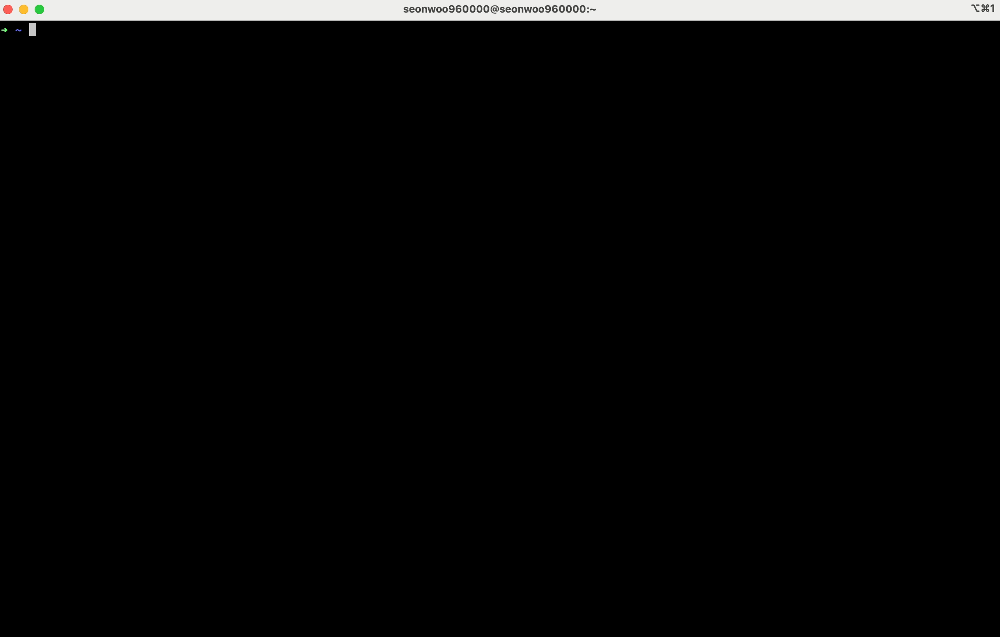

# TODO-CLI 

todo-cli is a simple command line tool to manage your todo list. 

## Installation 
  
### Clone the repository
```bash
# clone the repository and change directory  
$ git clone https://github.com/seonWKim/todo-cli.git 
$ cd todo-cli 
```

### Set up project 
```bash
# Ensure the local bin directory exists
mkdir -p $HOME/.tc/bin

# Create a symbolic link to the binary
ln -s $PWD/todo-cli $HOME/.tc/bin/tc

# Ensure the local bin directory is in the PATH and add it to ./zshrc or ./bashrc
if [[ ":$PATH:" != *":$HOME/.tc/bin:"* ]]; then
    if [[ -f $HOME/.zshrc ]]; then
        if ! grep -q 'export PATH=$HOME/.tc/bin:$PATH' $HOME/.zshrc; then
            echo 'export PATH=$HOME/.tc/bin:$PATH' >> $HOME/.zshrc
            echo "Please run: source $HOME/.zshrc"
        fi
    elif [[ -f $HOME/.bashrc ]]; then
        if ! grep -q 'export PATH=$HOME/.tc/bin:$PATH' $HOME/.bashrc; then
            echo 'export PATH=$HOME/.tc/bin:$PATH' >> $HOME/.bashrc
            echo "Please run: source $HOME/.bashrc"
        fi
    else
        echo "No .bashrc or .zshrc file found. Please create one and add the following line:"
        echo 'export PATH=$HOME/.tc/bin:$PATH'
    fi
fi
```
                    
## Usage 
                
### Basic 
```bash
# start interactive mode   
$ tc i 

# get all commands 
$ tc h 

# add a todo 
$ tc a "Buy milk"

# list all todos
$ tc l 

# find a todo
$ tc f

# mark a todo as done
$ tc d <id>

# mark a todo as undone
$ tc undone <id>

# update a todo
$ tc u <id> -t "Buy water"

# set a timer
$ tc t -m <minutes>      
``` 

## Development 

### Debugging sqlite  
```bash
# connect to the database 
$ sqlite3 ~/.tc/todo.db

# list tables 
sqlite> .tables 

# select all todos(table)  
sqlite> SELECT * FROM todos;  
```

### TODO 
- [ ] Add priority to the todos, sort and show by priority
- [ ] Add Alfred support 
- [ ] Deadline for todos 
- [ ] Feature to group todos 
